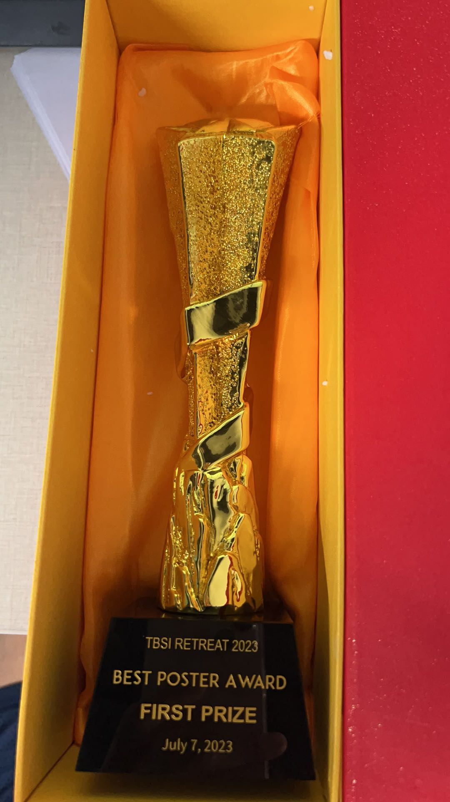
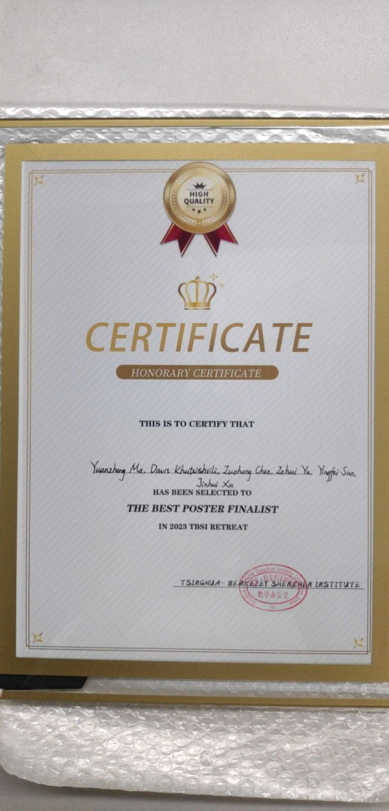
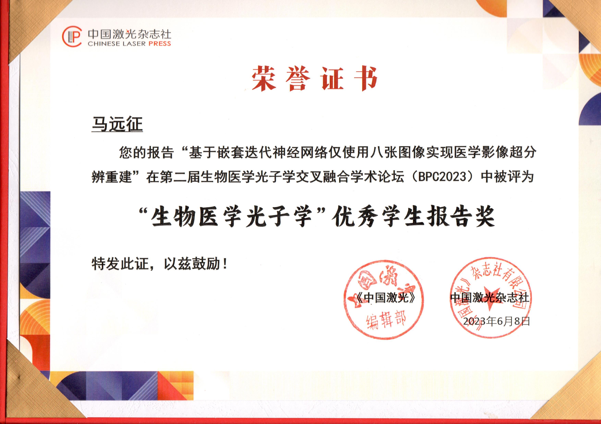

This is my [school homepage](https://www.tbsi.edu.cn/gx/main.htm)

# News

* 09/07/2023

Congratulations to Yuanzheng & teammates on winning First Prize of Best Poster Award in the competition at TBSI retreat!

* 12/06/2023

Congratulations to Yuanzheng on winning Outstanding Student Report at BPC2023!

* 23/05/2023

Yuanzheng will present in [第二届“生物医学光子学交叉融合”学术论坛(BPC2023)](https://www.opticsjournal.net/Meeting/BPC2023.cshtml)  on "基于嵌套迭代神经网络仅使用八张图像实现医学影像超分辨重建", June 8-10, in Shanghai.

* 29/03/2023

Yuanzheng and I will prensent in [第三届全国光子论坛](http://www.htcis.net/MeetingMain/Index/GZLT2023) (held from 3.31 to 4.3 in Guangzhou) on Super-resolution Photoacoustic Angiography, and Silicon Photonics for 6G and Beyond.

* 18/02/2023

3 papers get in [*CLEO2023*](https://www.cleoconference.org/home/): 
1. *"Super-Resolution Photoacoustic Angiography Assisted by Images Forged from Hand-Drawn Graffiti (JTu2A.51)"* by Yuanzheng
2. *"Accelerated Brillouin Frequency Shift Estimation Algorithm"* by Di of CUHK
3. *"Record High Throughput using Electronic 2×2 MIMO with OAM Multiplexing (SF1M.3)"* by Mai of ULaval

Congratulations! CLEO is gonna be in-person only this year. We need to send someone there =)

- 09/02/2023

I will serve the technical program committee of [*IEEE Photonics Conference (IPC2023)*](https://ieee-ipc.org/) in Orlando, USA; and [*2023 International conference on Optical Communication and Optical Information Processing (OCOIP 2023)*](http://www.ocoip.com/) in Sanya, China.

- 08/02/2023

An invited talk titled 'Silicon Photonics for High-Speed 5G and Optical Networks' will be delivered at [*OFC2023*](https://www.ofcconference.org/), session Tu2B, on March 7, 2023, together with Leslie.

- 26/12/2022

As one of the two Core-PIs, I have secured an inter-disciplinary funding from Tsinghua SIGS, focusing on the miniaturition of sensors and monitoring of greenhouse gas, together with Prof. Longfei Yu of iEE (Institute of Environment and Ecology), Tsinghua SIGS. 

- 12/12/2022

One funding from Shenzhen municipal natural science funding (NSF) is successfully granted.

- 18/11/2022

An invited review paper together with Zuhang Geng, Prof. Faisal N. Khan and Prof. Yuhan Dong, ['*Advances in Visible Light Communication Technologies and Applications,*'](https://www.mdpi.com/2304-6732/9/12/893/htm) has been accepted to *MDPI Photonics*.

- 17/11/2022

Our paper, ['*Using Standard 2×2 MIMO to Increase Capacity of Spatial Multiplexing with OAM Modes,*'](https://ieeexplore.ieee.org/document/9971714/) has been accepted to *Journal of Lightwave Technology*. 

Orbital angular momentum (OAM) uses the mode mension in ring core fiber to carry more data volume within limited space. Because of the special mode orthogonality of OAM mode and low crosstalk, it uses very simple digital signal processing (DSP) for mode demultiplexing, unlike its counterpart by linear polarization (LP) mode. In this paper, only standard 2x2 MIMO, commonly used in the mainstream coherent receivers, are used. It is an economic way of upgrading our current fiber communication systems.

- 30/10/2022

An invited talk has been given in [*GoInc2022*](https://www.koushare.com/topicIndex/i/GoInc2022) Track 3.

- 7/10/2022

A paper by Di, me and [Prof. Calvin Chan](https://lightweb.ie.cuhk.edu.hk/) entitled "*An Efficient Ternary Search for Dynamic Brillouin Frequency Shift in BOTDA*" has been accepted to [*ACP 2022*](http://www.acp2022.org/). 

- 13/09/2022

We've got reinforcement by our new members, *马远征 (Yuanzheng Ma)* and *王欣悦 (Xinyue Wang)*. Welcome to **LIT**!

- 12/09/2022

I will serve as a guest editor of a special issue of "*Optical Network Design and Optimization*" of *MDPI Photonics*, together of Prof. Qiu Yang. Check [*link*](https://www.mdpi.com/journal/photonics/special_issues/DN426N7VV4) or [*flyer*](https://mycuhk-my.sharepoint.com/:b:/g/personal/1155021186_link_cuhk_edu_hk/Ed446pRdXutNr3z1fpSylmUBKUmkSB8MV8cnwyd6tTbwfA?e=bf3UQN) for more details.

- 29/08/2022

I am to give an invited talk in [*PHOTOPTO 2023*](https://www.thescimeets.org/photopto2023/) in Paris (tentatively, dependent on travel restriction).

- 28/08/2022

I am to deliver an invited talk in [*OGC 2022*](http://www.ipsogc.org/) in Shenzhen (luckily no travel issue). *Update on Sep. 7: the conference has been postponed due to pandemic issue*. *Update on Dec. 11: the talk has been given as of today.*

- 20/08/2022

Our paper entitled '*Optimizing Geometric Constellations for Phase Noise Channels Using Deep Learning*' by Omir, me, Ming and Leslie has been accepted as an oral presentation in [*IEEE IPC*](https://ieee-ipc.org/), Nov. 2022 in Vancouver, Canada. 

Our paper entitled '*Equalizer Complexity in OAM Transmission Systems using a Standard PDM Coherent Receiver*' by Mai, Satyendra, Ariane, Nathalie, me, Lixian, Sophie and Leslie has been accepted as an oral presentation in [*IEEE IPC*](https://ieee-ipc.org/), Nov. 2022 in Vancouver, Canada. 

- 05/08/2022

As a Co-PI I have successfully secured a Shenzhen municipal funding, led by Prof. Min Ye of TBSI. 

- 28/06/2022

I will serve as a TPC member in [*ONDM2023*](https://ondm2023.inescc.pt/), held in Coimbra, Portugal.

- 24/06/2022

A paper in collaboration with [Prof. Leslie Ann Rusch](https://ocl.fsg.ulaval.ca/team/leslie-rusch) and group, of Universit&eacute; Laval, '*Expanded Modal Capacity for OAM with Standard 2×2 MIMO*', has been accepted to [*ECOC 2022*](https://www.ecoc2022.org/) held in Basel, Switzerland.

- 10/05/2022

My paper entitled ['*Experimental Demonstration of a Constellation Shaped via Deep Learning and Robust to Residual-Phase-Noise*'](https://ocl.fsg.ulaval.ca/fileadmin/user_upload/CLEO2022_Leslie.pdf), is presented at *CLEO 2022* held in San Jose, California, USA. 

