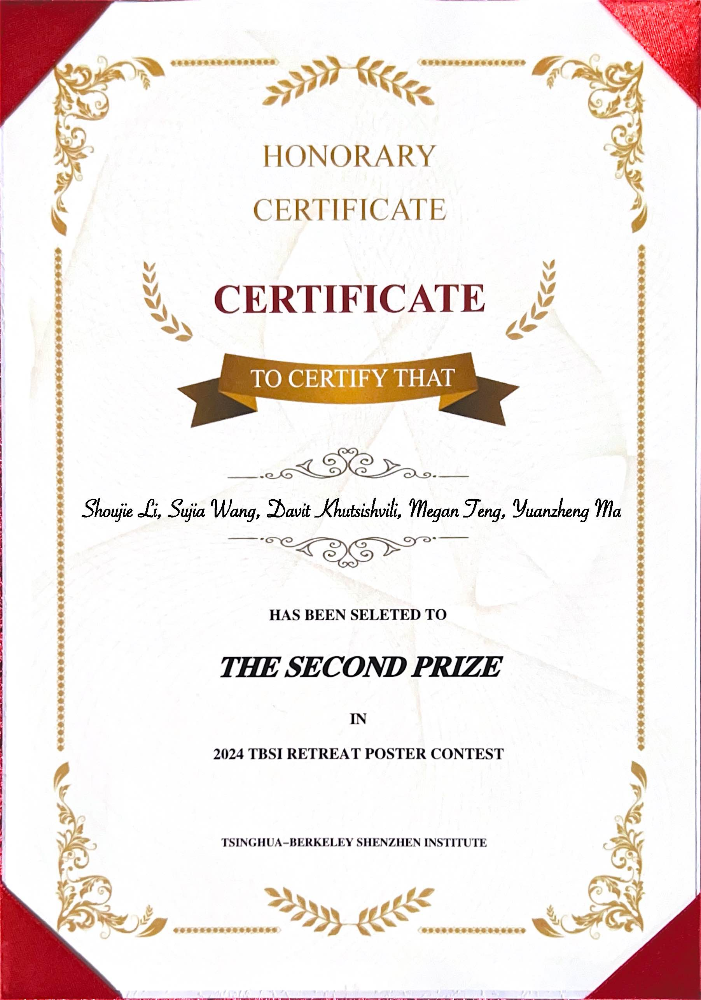

This is my [school homepage](https://www.sigs.tsinghua.edu.cn/gx_en/main.psp) and Chinese version at [主页](https://www.sigs.tsinghua.edu.cn/gx/main.htm)

## News

    <h4 class="news-title">Conference</h4>
    26/05/2025
    
 We have three papers accepted to <strong><a href="https://www.oeccpsc2025.org/">OECC2025</a></strong> in Sapporo, Hokkaido, Japan:  
    <ol>
        <li>Yuxuan Liu#, Chonghao Zhang#, Yuhan Dong, and Xun Guan, "Multi-Parameter Sensing Using a Seven-Core Structure: A High-Sensitivity Method for Chemical and Temperature Detection". </li>
        <li>Feiyu Jiao, Yansong Du, Yuting Zhou, Jingtong Yao, Qiang Jin, Bangyao Wang, Zhancong Xu, Juntian Qu, and Xun Guan, "Performance Analysis of NOMA in SiPM-based VLC Systems".</li>
        <li>Yuting Zhou#, Yuxuan Liu#, Yansong Du, Feiyu Jiao, Jingtong Yao, Bangyao Wang, Simeng Li, Jian Song, and Xun Guan, "High-Sensitivity Refractive Index Sensor Based on SU-8 Polymer Micro-Ring Resonator". </li>
    </ol>
    This is Yuxuan's and Feiyu's first publication since joining our lab. We shall be sharing their works next month in Japan.
    

    

        <h4 class="news-title">Journal</h4>
        25/05/2025
        
Yuanzheng's paper has been accepted to <strong><a href="https://www.sciencedirect.com/journal/pattern-recognition">Pattern Recognition</a></strong>. Please check it at   
        Yuanzheng Ma, Fan Xia, Liwei Lin, and Xun Guan, "<strong><a href="https://www.sciencedirect.com/science/article/pii/S003132032500442X">LEGO: LLM-enhanced genetic optimization for underwater robot image restoration</a></strong>", Pattern Recognition, 2025.
        

    

 

    

        <h4 class="news-title">Journal</h4>
        14/04/2025
        
 Jiaojiao's paper has been accepted to  <strong><a href="https://pubs.acs.org/journal/ascefj">IEEE Transactions on Communications</a></strong>:  
        Jiaojiao Wang, Dabin Zheng and Xun Guan, "<strong><a href="https://ieeexplore.ieee.org/document/10975044">Rack-aware MSR Codes with Optimal Access for Multiple Sequentially Ordered Node Failures</a></strong>, IEEE Transactions on Communications, 2025.  
        Congratulations!
        

    

 

    

        <h4 class="news-title">Journal</h4>
        07/04/2025
        
 Our paper is appearing in <strong><a href="https://pubs.acs.org/journal/ascefj">ACS Sensors</a></strong>:  
        Zecong Liu, Chao Xiang, Yeyu Tong, Kwai Hei Li, and Xun Guan, <strong><a href= "https://pubs.acs.org/doi/10.1021/acssensors.4c03404">"Transfer Learning Enhanced Blood Pressure Monitoring Based on Flexible Optical Pulse Sensing Patch"</a></strong>, ACS Sensors, 2025.  
        Congratulations to all!
        

    

 

    

        <h4 class="news-title">Conference</h4>
        01/04/2025
        
 Yansong's following submission to CLEO/Europe-EQEC has been accepted. Check it out in Berlin in June!  
        Yansong Du, Jingtong Yao, Feiyu Jiao, Yuting Zhou, Qiang Jin, Bangyao Wang, Kang An, Zhaoxiang Jiang, Xun Guan, "A New Method for Removing Internal Scattering Noise in iToF Camera," in CLEO/Europe-EQEC, Berlin, Germany, June 2025. 
        Congratulations to him!
        

    

  

    

        <h4 class="news-title">Journal</h4>
        01/04/2025
        
Yuanzheng's paper has been accepted to Advanced Photonics Nexus. Stay tuned for the following if you are interested!   
        Yuanzheng Ma, Davit Khutsishvili, Zihan Zang, Wei Yue, Zhen Guo, Tao Feng, Zitian Wang, Shaohua Ma, and Xun Guan, "<strong><a href="https://www.spiedigitallibrary.org/journals/advanced-photonics-nexus/volume-4/issue-03/036007/PLayer--a-plug-and-play-embedded-neural-system-to/10.1117/1.APN.4.3.036007.full">PLayer: A Plug-and-Play Embedded Neural System to Boost Neural Organoid 3D Reconstruction</a></strong>", Advanced Photonics Nexus, 2025.
        

    

  

    

        <h4 class="news-title">Conference</h4>
        01/04/2025
        
Tao Feng has got two new acceptances from ICME, held in Nantes, France, June-July, 2025. Here are the details: 
        <ol>
            <li>T. Feng, Z. Zhao, Y. Xie, Y. Ye, X. Luo, X. Guan, and Y. Li, "STFTCodec: High-Fidelity Audio Compression through Time-Frequency Domain Representation". </li>
            <li>T. Feng, Y. Xie, X. Guan, J. Song, Z. Liu, F. Ma, and F. Yu, "UniSync: A Unified Framework for Audio-Visual Synchronization".</li>
        </ol>
        Congratulations to him!
        

    

  

    

        <h4 class="news-title">Conference</h4>
        04/03/2025
        
We are thrilled to anounce 3 papers, all first authored by our lab members, are appearing in <strong><a href="https://cleoconference.org/">CLEO </a></strong> this year, including
        <ol>
            <li>Yufeng Wang, Zecong Liu, Yuting Zhou, Xinke Tang, and Xun Guan, "Optoelectronic Joint Pre-Equalization Using Parallel GaN-based Green LED Arrays for Underwater VLC". </li>
            <li>Zecong Liu, Yufeng Wang, Chonghao Zhang, Kwai Hei Li, and Xun Guan, "Monolithic Integrated GaN Optoelectronics for Underwater Visible Light Communication and Sensing Systems".</li>
            <li>Yansong Du, Jingtong Yao, Feiyu Jiao, Bangyao Wang, Zhen Xu, Qiang Jin, Yuanzheng Ma, Zhaoxiang Jiang, and Xun Guan, "Random Phase Noise Optimization for iToF Cameras". </li>
        </ol>
        All 3 papers are for oral presentations. Congratulations to Yufeng, Zecong, Yansong, and all collaborators!
        

    

  

    

        <h4 class="news-title">Journal</h4>
        20/1/2025
        
Yansong's paper  entitled "<a href="https://opg.optica.org/oe/fulltext.cfm?uri=oe-33-2-1983&id=567005">Modeling, analysis, and optimization of random error in indirect time-of-flight camera </a>"  has appeared in <strong>Optics Express</strong>!

    

 

    

        <h4 class="news-title">Conference</h4>
        10/12/2024
        
Mingzi's paper entitled "JAQ: Joint Efficient Architecture Design and Low-Bit Quantization with Hardware-Software Co-Exploration" has been accepted to <strong>AAAI</strong> held in Philadelphia, Pennsylvania, USA during February 25 – March 4. Big congratulations!

    

  

    

        <h4 class="news-title">Conference</h4>
        08/10/2024
        
<strong>Photonics West</strong>  has accepted Yuanzheng's oral presentation titled "LiGO: LLM-enhanced iterative graphic optimization for super-resolution underwater 3D reconstruction". The event is between 25 - 30 January 2025, at The Moscone Center, San Francisco, California, United States.

    

  

    

        <h4 class="news-title">Conference</h4>
        17/09/2024
        
Our paper "Enhancing VLC Vehicle Networks in Channel Estimation, Coding, and Multiple Access" has been accepted for oral presentation at <strong>Globecom 2024 workshop on Emerging Topics in 6G Communications</strong>. Splendid work by Rui Chen and Jiaojiao Wang, and Xinjie Yuan from Prof. Shao-Lun Huang's group!

    

  

    

        <h4 class="news-title">Journal</h4>
        07/09/2024
        
Two more accepted papers.   One at <strong>Nature Communications</strong> with <strong>Prof. Zhongjin Lin</strong> at Sun Yat-sen University, titled "120 GOPS/neuron Photonic Tensor Core in Thin-film Lithium Niobate for Inference and in-situ Training".   The other at <strong>IEEE Open Journal of the Communications Society</strong>, with <strong>Ms. Liyan Zheng</strong> and <strong>Prof. Yuhan Dong</strong> of Tsinghua SIGS, titled "Mutual Information Optimization with PAPR Reduction for MISO-OFDM UWOC through Probabilistic Shaping and Precoding".   Huge congratulations!

    

  

    

        <h4 class="news-title">Journal</h4>
        01/08/2024
        
<strong>Zecong</strong>'s paper, "Magnet-Assisted GaN Monolithically Integrated Device for Optical Three-Axis Motion Sensing", has been accepted to <strong>ACS Photonics</strong>.

    

  

    

        <h4 class="news-title">Conference</h4>
        01/08/2024
        
We have a few conference contributions to annouce: 
        <ol>
            <li><strong>Jiaojiao Wang</strong> has a paper accepted for oral presentation at IEEE Information Theory Workshop 2024 (<strong>IEEE ITW 2024</strong>) to be held in Shenzhen, China. The title is "Rack-aware Minimum-Storage Regenerating Codes with Optimal Access for Consecutive Node Failures". </li>
            <li><strong>Jiazhen Song</strong> with <strong>Prof. Zhenyu Liu</strong> has one contribution to <strong>IEEE Globecom 2024</strong> in Cape Town, South Africa, titled "THz Optical Image Recognition Method via AM-Res2Net Model".</li>
            <li><strong>Weijie Dai</strong> with <strong>Prof. Yuhan Dong</strong> has two accepted papers to Optica Frontiers in Optics and Laser Science 2024 (<strong>FiO LS 2024</strong>) to be held in Denver, Colorado, USA. The titles are "OAM Spectral Asymmetry Identification and Symbol-level Detection in Twisted Partially Coherent FSO Links" and "Concurrence Modulation and Direct Detection Free-space Optical Communication Systems under General Stokes Detection Noise".</li>
        </ol>
        Big congratulations to everyone!
        

    

  

    

        <h4 class="news-title">Award</h4>
        08/07/2024
        
Our students in two groups wins second and third prizes in TBSI retreat poster conference competition. Kudos to all! 

        
        
    

  

    

        <h4 class="news-title">Conference</h4>
        15/06/2024
        
I attended "第二届光通信与光电器件发展论坛" in Qingdao, a beatiful coastal city. A talk was given at the conference titled "单片集成微力传感器及其连续无创动脉压监测". The day ended up with 10 km seaside run and a huge glass of Tsingtao beer! 

        
    

  

    

        <h4 class="news-title">Conference</h4>
        05/04/2024
        
Yuanzheng will present his new result of underwater imaging in <a href="https://uaegsrc.ae/">UAEGSRC</a>, held in Al Ain in United Arab Emirates. The presetation date is April 20, 2024. He has also won a travel grant sponsored by the conference host! 

    

   

    

        <h4 class="news-title">Conference</h4>
        17/02/2024
        
Yuanzheng is going to CLEO again (in Charlotte instead of California so mind your airticket destination!) this May to present his new finding of "Enhancing Underwater Imaging for Robot through Embedded Polarization Neural Network"!

    

   

    

        <h4 class="news-title">Journal</h4>
        08/02/2024
        
Thrilled to announce that our article <a href="https://www.sciencedirect.com/science/article/pii/S1361841524000318">"DOVE: Doodled Vessel Enhancement for Photoacoustic Angiography Super Resolution"</a> has been accepted to <em>Medical Image Analysis</em>. Great work by Yuanzheng and all collaborators! Kindly visit <a href="https://github.com/yuanzhengthu/handDrawnPAAImages"><em>Yuanzheng's GitHub repository</em></a> for the code and app of this work.

    

    <!-- 重复上述结构来添加更多新闻条目 -->

    

        <h4 class="news-title">Journal</h4>
        01/02/2024
        
Our paper <a href="https://ieeexplore.ieee.org/document/10420452">"Enhanced Performance for SSB-OFDM Transmission with a Low-Chirp Silicon MRM"</a> has been accepted to *IEEE/Optica Journal of Lightwave Technology*. Congratulations to Zibo and all co-authors!

    

    <!-- 重复上述结构来添加更多新闻条目 -->

    

        <h4 class="news-title">Talk</h4>
        08/12/2023
        
I'll give an invited talk at <a href="https://b2b.csoe.org.cn/meeting/O_WEST2023.html">O-West</a> held by Chinese Society for Optical Engineering (中国光学工程学会) on Dec. 17 in Chengdu, Sichuan. My talk is in track T5 - Optoelectronic integration and system applications.

    

    

    

        <h4 class="news-title">Award</h4>
        07/11/2023
        
We win best student paper at <a href="http://www.acpconf.com/">ACP/POEM2023</a>!

        
    

    

    

        <h4 class="news-title">Talk</h4>
        04/11/2023
        
An invited talk was given today at <a href="http://www.acpconf.com/">ACP/POEM2023</a> workshop 5 "Optical Wireless Communication for 6G". Now stay tuned for Davit's talk tomorrow. We are also in the finalist of Best Student Paper ^_^

    

    

    

        <h4 class="news-title">Talk</h4>
        13/09/2023
        
I'll give an invited talk in <a href="http://www.acpconf.com/">ACP2023</a> <a href="http://www.acpconf.com/detail/Workshop%206">workshop 6: Optical Wireless Communication for 6G</a>.

    

    

    

        <h4 class="news-title">Conference</h4>
        13/09/2023
        
Our submission to <a href="http://www.acpconf.com/">ACP2023</a>, 'Exploring the Neural Organoid in High Definition: Physics-Inspired High-Throughout Super-Resolution 3D Image Reconstruction', has been accepted. Congratulations to our collaborators, Davit Khutsishvili, Zitian Mi, Prof. Shaohua Ma, and Yuanzheng!

    

    

    

        <h4 class="news-title">Talk</h4>
        07/09/2023
        
An invited talk on 'Silicon Microring Modulator for 6G Optical Access Networks: On Polarization, Chirp and Dispersion' is given at <a href="http://www.ipsogc.org/">OGC2023</a>.

    

    

    

        <h4 class="news-title">Journal</h4>
        01/09/2023
        
Our paper, <a href="https://opg.optica.org/oe/fulltext.cfm?uri=oe-31-20-31946&id=537351">"Peak-tracking BOTDA with dynamic ternary search,"</a> by D. Qi, X. Guan*, Y. Cheng and C. K. Chan, has been accepted to Optics Express.

    

    

    

        <h4 class="news-title">TPC</h4>
        17/08/2023
        
<a href="https://mp.weixin.qq.com/s/QR51xIqd6Bd2-e3xfF3dRw">Visible Light Communications and Optical Computing Conference (VLCOC)</a> is approaching! I'll serve as the TPC chair the two-day event from this Saturday. See you in Shenzhen!

    

    

    

        <h4 class="news-title">TPC</h4>
        25/07/2023
        
Welcome to Shenzhen! I'll chair “可见光通信与光计算大会” to be hosted in August in University Town Shenzhen. Check out <a href="https://mp.weixin.qq.com/s/GQTxhWGcbbvBMAFBGhroPw" target="_blank">this link</a> and stay tuned.

    

    

    

        <h4 class="news-title">Conference</h4>
        14/07/2023
        
Yuanzheng's paper presented in BPC2023 is published in SPIE Proceedings.

    

    <!-- 此处可以继续添加更多新闻条目 -->

    <h4 class="news-title">Award</h4>
    09/07/2023
    
Congratulations to Yuanzheng & teammates on winning First Prize of Best Poster Award in the competition at TBSI retreat!

    
    

    <h4 class="news-title">Award</h4>
    12/06/2023
    
Congratulations to Yuanzheng on winning Outstanding Student Report at BPC2023!

    

    <h4 class="news-title">Conference</h4>
    23/05/2023
    
Yuanzheng will present in <a href="https://www.opticsjournal.net/Meeting/BPC2023.cshtml">第二届“生物医学光子学交叉融合”学术论坛(BPC2023)</a> on "基于嵌套迭代神经网络仅使用八张图像实现医学影像超分辨重建", June 8-10, in Shanghai.

    <h4 class="news-title">Talk</h4>
    29/03/2023
    
Yuanzheng and I will present in <a href="http://www.htcis.net/MeetingMain/Index/GZLT2023">第三届全国光子论坛</a> (held from 3.31 to 4.3 in Guangzhou) on Super-resolution Photoacoustic Angiography, and Silicon Photonics for 6G and Beyond.

    <h4 class="news-title">Conference</h4>
    18/02/2023
    
3 papers get in <a href="https://www.cleoconference.org/home/">CLEO2023</a>: 
    <ol>
        <li>"Super-Resolution Photoacoustic Angiography Assisted by Images Forged from Hand-Drawn Graffiti (JTu2A.51)" by Yuanzheng</li>
        <li>"Accelerated Brillouin Frequency Shift Estimation Algorithm" by Di of CUHK</li>
        <li>"Record High Throughput using Electronic 2×2 MIMO with OAM Multiplexing (SF1M.3)" by Mai of ULaval</li>
    </ol>
    Congratulations! CLEO is gonna be in-person only this year. We need to send someone there =)
    

    <h4 class="news-title">TPC</h4>
    09/02/2023
    
I will serve the technical program committee of <a href="https://ieee-ipc.org/">IEEE Photonics Conference (IPC2023)</a> in Orlando, USA; and <a href="http://www.ocoip.com/">2023 International conference on Optical Communication and Optical Information Processing (OCOIP 2023)</a> in Sanya, China.

<!-- 请根据上面的示例继续转换剩余的Markdown到HTML -->

    <h4 class="news-title">Talk</h4>
    08/02/2023
    
An invited talk titled 'Silicon Photonics for High-Speed 5G and Optical Networks' will be delivered at <a href="https://www.ofcconference.org/">OFC2023</a>, session Tu2B, on March 7, 2023, together with Leslie.

    <h4 class="news-title">Funding</h4>
    26/12/2022
    
As one of the two Core-PIs, I have secured an inter-disciplinary funding from Tsinghua SIGS, focusing on the miniaturition of sensors and monitoring of greenhouse gas, together with Prof. Longfei Yu of iEE (Institute of Environment and Ecology), Tsinghua SIGS.

    <h4 class="news-title">Funding</h4>
    12/12/2022
    
One funding from Shenzhen municipal natural science funding (NSF) is successfully granted.

    <h4 class="news-title">Journal</h4>
    18/11/2022
    
An invited review paper together with Zuhang Geng, Prof. Faisal N. Khan and Prof. Yuhan Dong, <a href="https://www.mdpi.com/2304-6732/9/12/893/htm">'Advances in Visible Light Communication Technologies and Applications,'</a> has been accepted to MDPI Photonics.

    <h4 class="news-title">Journal</h4>
    17/11/2022
    
Our paper, <a href="https://ieeexplore.ieee.org/document/9971714/">'Using Standard 2×2 MIMO to Increase Capacity of Spatial Multiplexing with OAM Modes,'</a> has been accepted to Journal of Lightwave Technology.  
    <!--Orbital angular momentum (OAM) uses the mode dimension in ring core fiber to carry more data volume within limited space. Because of the special mode orthogonality of OAM mode and low crosstalk, it uses very simple digital signal processing (DSP) for mode demultiplexing, unlike its counterpart by linear polarization (LP) mode. In this paper, only standard 2x2 MIMO, commonly used in the mainstream coherent receivers, are used. It is an economic way of upgrading our current fiber communication systems.-->

    <h4 class="news-title">Talk</h4>
    30/10/2022
    
An invited talk has been given in <a href="https://www.koushare.com/topicIndex/i/GoInc2022">GoInc2022</a> Track 3.

    <h4 class="news-title">Conference</h4>
    07/10/2022
    
A paper by Di, me and <a href="https://lightweb.ie.cuhk.edu.hk/">Prof. Calvin Chan</a> entitled "An Efficient Ternary Search for Dynamic Brillouin Frequency Shift in BOTDA" has been accepted to <a href="http://www.acp2022.org/">ACP 2022</a>.

    <h4 class="news-title">Team</h4>
    13/09/2022
    
We've got reinforcement by our new members, 马远征 (Yuanzheng Ma) and 王欣悦 (Xinyue Wang). Welcome to LIT!

    <h4 class="news-title">Editorship</h4>
    12/09/2022
    
I will serve as a guest editor of a special issue of "Optical Network Design and Optimization" of MDPI Photonics, together of Prof. Qiu Yang. Check <a href="https://www.mdpi.com/journal/photonics/special_issues/DN426N7VV4">link</a> or <a href="https://mycuhk-my.sharepoint.com/:b:/g/personal/1155021186_link_cuhk_edu_hk/Ed446pRdXutNr3z1fpSylmUBKUmkSB8MV8cnwyd6tTbwfA?e=bf3UQN">flyer</a> for more details.

    <h4 class="news-title">Talk</h4>
    29/08/2022
    
I am to give an invited talk in <a href="https://www.thescimeets.org/photopto2023/">PHOTOPTO 2023</a> in Paris (tentatively, dependent on travel restriction).

    <h4 class="news-title">Talk</h4>
    28/08/2022
    
I am to deliver an invited talk in <a href="http://www.ipsogc.org/">OGC 2022</a> in Shenzhen (luckily no travel issue). Update on Sep. 7: the conference has been postponed due to pandemic issue. Update on Dec. 11: the talk has been given as of today.

    <h4 class="news-title">Conference</h4>
    20/08/2022
    
Our paper titled 'Optimizing Geometric Constellations for Phase Noise Channels Using Deep Learning' by Omir, me, Ming and Leslie has been accepted as an oral presentation in <a href="https://ieee-ipc.org/">IEEE IPC</a>, Nov. 2022 in Vancouver, Canada.

    <h4 class="news-title">Funding</h4>
    05/08/2022
    
As a Co-PI I have successfully secured a Shenzhen municipal funding, led by Prof. Min Ye of TBSI.

    <h4 class="news-title">TPC</h4>
    28/06/2022
    
I will serve as a TPC member in <a href="https://ondm2023.inescc.pt/">ONDM2023</a>, held in Coimbra, Portugal.

    <h4 class="news-title">Conference</h4>
    24/06/2022
    
A paper in collaboration with <a href="https://ocl.fsg.ulaval.ca/team/leslie-rusch">Prof. Leslie Ann Rusch</a> and group, of Université Laval, 'Expanded Modal Capacity for OAM with Standard 2×2 MIMO', has been accepted to <a href="https://www.ecoc2022.org/">ECOC 2022</a> held in Basel, Switzerland.

    <h4 class="news-title">Conference</h4>
    10/05/2022
    
My paper titled <a href="https://ocl.fsg.ulaval.ca/fileadmin/user_upload/CLEO2022_Leslie.pdf">'Experimental Demonstration of a Constellation Shaped via Deep Learning and Robust to Residual-Phase-Noise'</a>, is presented at CLEO 2022 held in San Jose, California, USA.

